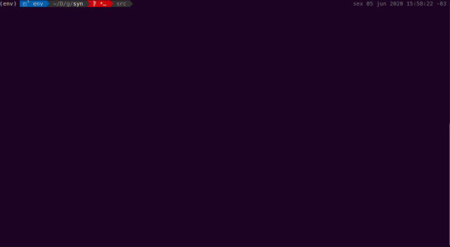
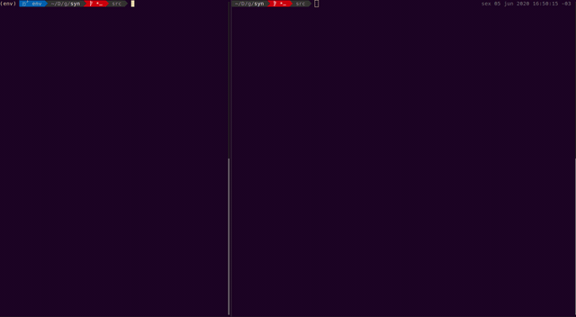

# Syn - sinônimos e dicionário na linha de comando

Esta foi uma ferramenta que desenvolvi para me auxiliar na escrita de um trabalho acadêmico. Percebi durante a escrita que consultas ao dicionário de sinônimos e significados se torna uma tarefa constante, demorada e fundamental para evitar a repetição de palavras e econtrar os melhores termos para expressar uma ideia.

Para evitar a perda de tempo com pesquisas constantes, decidi perder tempo desenvolvendo uma aplicação para evitar que eu perdesse tempo... (?)

Este é o ***syn***, uma simples ferramenta de *web scraping* escrita em *Python 3*. A princípio ela é executada na linha de comando, faz *web scraping* de sites com significados e sinônimos e os mostra de forma colorida🌈 legível e ao ser-humano.

Posteriormente adicionei a possibilidade de acessar os resultados através de uma API Flask.

## *Setup*

As bibliotecas necessárias para a execução da ferramenta estão em `requirements.txt`. O comando `pip install -r requirements.txt` deve instalar estas bibliotecas no ambiente *Python* corrente.

## Linha de comando

* `./syn`: abre o programa no modo interativo. Use `ctrl + c` para sair;
* `./syn <palavra>`: faz a busca por `<palavra>`, exibe e termina a execução;
* `./syn --server [PORT]` ou `./syn -s [PORT]`  inicia a ferramenta no modo API, rodando na porta `PORT` ou `5000`, caso `PORT` não seja definido.

## Modo API

Rode `./syn --server [PORT]` ou `./syn -s [PORT]`  inicia a ferramenta no modo API, rodando na porta `PORT` ou `5000`, caso `PORT` não seja definido.

### Endpoints

* `/synonyms/<word>`: busca dados em https://www.sinonimos.com.br;
* `/autocomplete/<word>`: busca dados em https://www.dicionarioinformal.com.br/ajax.php;
* `/informal-dictionary/<word>`: busca dados em https://www.dicionarioinformal.com.br;
* `/dictionary/<word>`: busca dados em https://www.dicio.com.br.